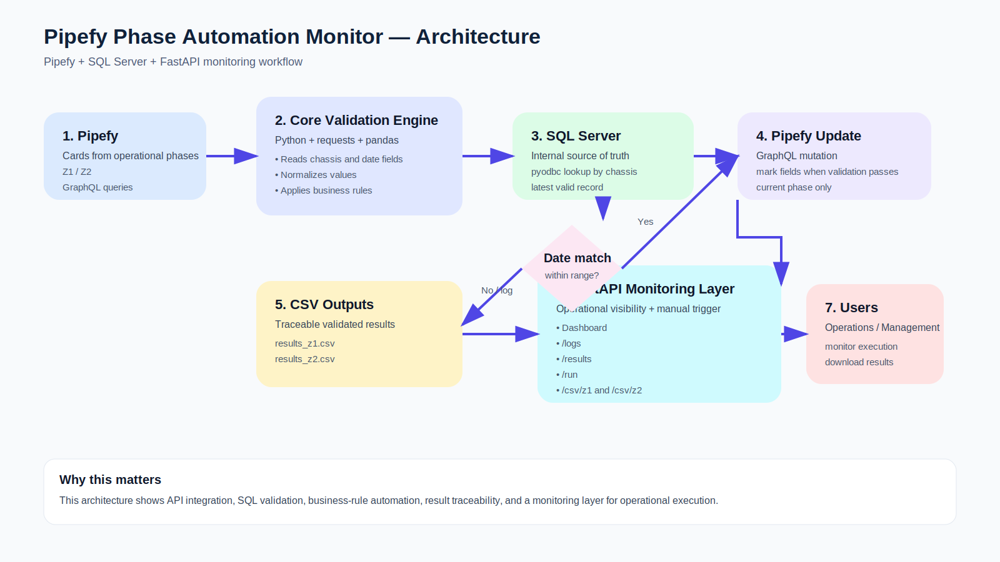

# Pipefy Phase Automation Monitor

Backend automation project that validates operational cards in **Pipefy** against **SQL Server** records and automatically updates phase fields when business rules are met.

This repository showcases my experience in **process automation, API integration, SQL-based validation, backend development, and operational monitoring**.

---

## Business Context

In operational workflows, teams often need to manually verify whether a vehicle record in Pipefy matches the latest information stored in the internal database before moving a case forward.

This project automates that validation process by:

- reading cards from Pipefy phases,
- extracting key fields such as **chassis** and **installation date**,
- comparing them against SQL Server records,
- updating Pipefy fields when the dates match within an allowed range,
- generating traceable CSV outputs,
- exposing a monitoring panel for visibility and manual execution.

---

## Main Objective

Automate the validation of Pipefy cards against internal SQL records to reduce manual review time, improve traceability, and support operational teams with faster processing.

---

## Core Capabilities

- Reads cards from configured Pipefy phases via **GraphQL API**
- Retrieves **chassis** and **installation-related dates**
- Connects to **SQL Server** using `pyodbc`
- Validates whether Pipefy and SQL dates match within a configurable day range
- Updates Pipefy fields automatically when the validation passes
- Stores validated results in CSV files
- Provides a **FastAPI monitoring dashboard** with logs and downloadable outputs
- Executes automatically on startup and then every 2 hours

---

## Business Value

This project demonstrates practical value in real operational environments by:

- reducing manual validation effort,
- improving process traceability,
- minimizing human error in workflow updates,
- centralizing monitoring and execution visibility,
- enabling faster operational follow-up.

It is also relevant to my professional profile because it reflects experience in:

- **API integration** with Pipefy GraphQL,
- **backend development** with FastAPI,
- **SQL-based business validation**,
- **automation of operational workflows**,
- **monitoring and observability** for business processes,
- **production-oriented development**, including logs, scheduled execution, exports, and controlled updates.

---

## Architecture



### Mermaid Version

```mermaid
flowchart LR
    A["Pipefy Cards<br/>Z1 / Z2 phases"] --> B["Core Validation Engine<br/>Python + Requests + Pandas"]
    B --> C["Extract chassis and date fields"]
    C --> D["SQL Server Lookup<br/>pyodbc"]
    D --> E{"Dates match<br/>within allowed range?"}
    E -- Yes --> F["Update Pipefy fields<br/>GraphQL mutation"]
    E -- No --> G["Skip update and log result"]
    F --> H["CSV outputs<br/>results_z1.csv / results_z2.csv"]
    G --> H
    H --> I["FastAPI Monitor"]
    I --> J["Dashboard for management"]
    I --> K["/logs endpoint"]
    I --> L["/results endpoint"]
    I --> M["/csv/z1 and /csv/z2"]
